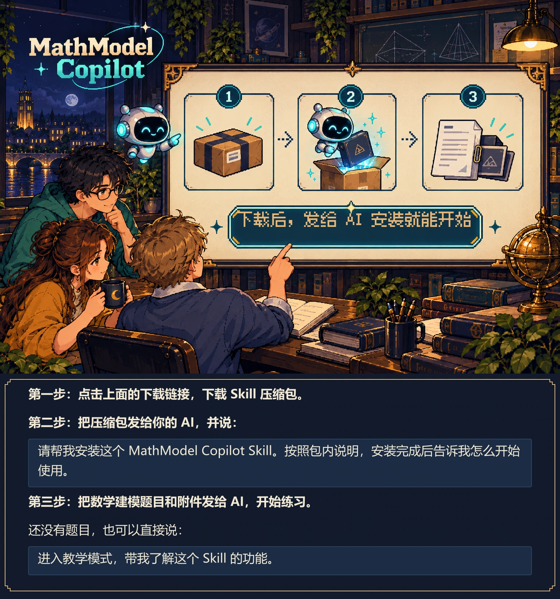
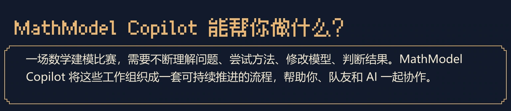
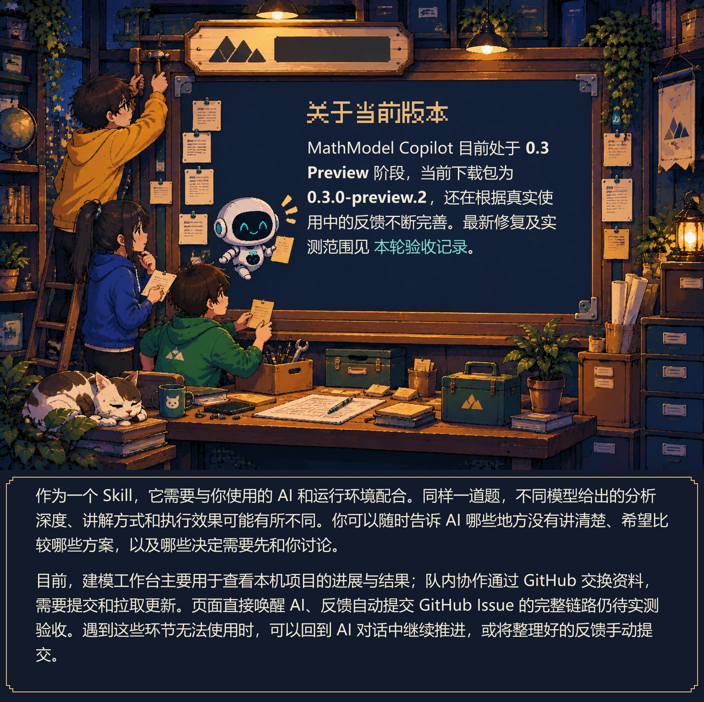

[产品理念](#user-content-pixel-产品理念) · [功能介绍](#user-content-pixel-mathmodel-copilot-能帮你做什么) · [反馈与参与](#user-content-pixel-反馈与参与)

<picture>
  <source media="(max-width: 640px)" srcset="assets/pixel-readme/00-mobile.webp">
  
</picture>

<picture>
  <source media="(max-width: 640px)" srcset="assets/pixel-readme/01-intro-mobile.webp">
  
</picture>

 
<picture>
  <source media="(max-width: 640px)" srcset="assets/pixel-readme/01-mobile.webp">
  
</picture>

<picture>
  <source media="(max-width: 640px)" srcset="assets/pixel-readme/02-mobile.webp">
  
</picture>

<picture>
  <source media="(max-width: 640px)" srcset="assets/pixel-readme/03-mobile.webp">
  
</picture>

<picture>
  <source media="(max-width: 640px)" srcset="assets/pixel-readme/04-mobile.webp">
  
</picture>

<picture>
  <source media="(max-width: 640px)" srcset="assets/pixel-readme/05-mobile.webp">
  
</picture>

<picture>
  <source media="(max-width: 640px)" srcset="assets/pixel-readme/06-mobile.webp">
  
</picture>

<picture>
  <source media="(max-width: 640px)" srcset="assets/pixel-readme/07-mobile.webp">
  
</picture>

<picture>
  <source media="(max-width: 640px)" srcset="assets/pixel-readme/08-mobile.webp">
  
</picture>

[GitHub 协作说明](docs/GIT_COLLABORATION.md)

<picture>
  <source media="(max-width: 640px)" srcset="assets/pixel-readme/09-mobile.webp">
  
</picture>

<picture>
  <source media="(max-width: 640px)" srcset="assets/pixel-readme/10-mobile.webp">
  
</picture>

<picture>
  <source media="(max-width: 640px)" srcset="assets/pixel-readme/11-mobile.webp">
  
</picture>

<picture>
  <source media="(max-width: 640px)" srcset="assets/pixel-readme/12-mobile.webp">
  
</picture>

<picture>
  <source media="(max-width: 640px)" srcset="assets/pixel-readme/13-mobile.webp">
  
</picture>

<picture>
  <source media="(max-width: 640px)" srcset="assets/pixel-readme/14-mobile.webp">
  
</picture>

<picture>
  <source media="(max-width: 640px)" srcset="assets/pixel-readme/15-mobile.webp">
  
</picture>

[本轮验收记录](docs/ACCEPTANCE_V032.md)

<picture>
  <source media="(max-width: 640px)" srcset="assets/pixel-readme/16-mobile.webp">
  
</picture>

<picture>
  <source media="(max-width: 640px)" srcset="assets/pixel-readme/17-mobile.webp">
  
</picture>

[安装指南](https://github.com/Odyphus/MathModel-Copilot/blob/main/docs/INSTALL.md) · [使用说明](https://github.com/Odyphus/MathModel-Copilot/blob/main/docs/EXPERIENCE_V03.md) · [GitHub 协作说明](https://github.com/Odyphus/MathModel-Copilot/blob/main/docs/GIT_COLLABORATION.md) · [工作台交互说明](https://github.com/Odyphus/MathModel-Copilot/blob/main/docs/LOCAL_INTERACTION.md) · [使用反馈说明](https://github.com/Odyphus/MathModel-Copilot/blob/main/docs/USAGE_FEEDBACK.md) · [产品术语](https://github.com/Odyphus/MathModel-Copilot/blob/main/docs/PRODUCT_LANGUAGE.md) · [贡献指南](https://github.com/Odyphus/MathModel-Copilot/blob/main/CONTRIBUTING.md) · [变更记录](https://github.com/Odyphus/MathModel-Copilot/blob/main/CHANGELOG.md) · [安全问题反馈方式](https://github.com/Odyphus/MathModel-Copilot/blob/main/SECURITY.md)

<picture>
  <source media="(max-width: 640px)" srcset="assets/pixel-readme/18-mobile.webp">
  
</picture>

[mathmodel-skill](https://github.com/handsomeZR-netizen/mathmodel-skill) · [上游说明](https://github.com/Odyphus/MathModel-Copilot/blob/main/UPSTREAM.md) · [许可范围](https://github.com/Odyphus/MathModel-Copilot/blob/main/LICENSE_SCOPE.md) · [第三方通知](https://github.com/Odyphus/MathModel-Copilot/blob/main/THIRD_PARTY_NOTICES.md)

展开完整原文（可复制、可搜索）

# MathModel Copilot

**把人的精力留给真正需要人的地方。**

一个面向数学建模比赛的 AI Skill，也是一套帮助人和 AI 持续协作的辅助系统。

[直接下载压缩包](https://github.com/Odyphus/MathModel-Copilot/raw/refs/heads/main/downloads/MathModel-Copilot-latest.zip) · [产品理念](#产品理念) · [功能介绍](#mathmodel-copilot-能帮你做什么) · [反馈与参与](#反馈与参与)

## 下载后，发给 AI 安装就能开始

**第一步：点击上面的下载链接，下载 Skill 压缩包。**

**第二步：把压缩包发给你的 AI，并说：**

> 请帮我安装这个 MathModel Copilot Skill。按照包内说明，安装完成后告诉我怎么开始使用。

**第三步：把数学建模题目和附件发给 AI，开始练习。**

还没有题目，也可以直接说：

> 进入教学模式，带我了解这个 Skill 的功能。

## 产品理念

现有很多数学建模 AI 工具，关注的是“怎样让 AI 替人完成更多工作”，例如自动选模型、自动写代码、自动生成论文。但是实际上，一场真正的数学建模比赛，并不是一个可以被简单自动化的任务。

一场比赛持续数天，需要不断地理解问题、提出想法、修改模型、运行实验、判断结果，并由三名队员和 AI 持续协作。真正重要的判断、创造和取舍，最终仍然需要人的参与。

因此，MathModel Copilot 的目标不是替代人，而是帮助人和 AI 更好地一起完成比赛。

它首先提供一套基本的工作流和脚手架，让 Agent 能够知道一场数学建模比赛应该如何推进，并让其持续参与从审题、建模、实验验证，到论文与最终交付的全过程。

在此之上，它希望把人的精力，从版本、文件、状态和重复检查等琐事中释放出来，留给真正需要人的地方——理解、判断、创造与取舍。

同时，它希望建立一条持续而高效的信息流：人的想法可以随时传递给 AI，而 AI 当前推进到了哪一步，也可以通过可视化的面板清晰地反馈给人；不同队员之间，则能够始终围绕同一套最新的信息和结果顺畅协作。

总结一下，MathModel Copilot 的目标，不是让 AI 取代人，而是让人和 AI 真正成为一个能够持续协作的建模团队。

## MathModel Copilot 能帮你做什么？

一场数学建模比赛，需要不断理解问题、尝试方法、修改模型、判断结果。MathModel Copilot 将这些工作组织成一套可持续推进的流程，帮助你、队友和 AI 一起协作。

### ① 从审题到交付，让 AI 持续参与整场比赛

为 AI 提供一套覆盖审题、建模、编程、实验验证、论文准备与最终交付的工作流。按子问拆解任务，明确前后依赖和交付要求，让 AI 知道当前做到哪一步、接下来该做什么。也支持根据实验结果回头检查假设、调整模型，再继续验证。

### ② 把思路讲透，让人有依据地判断与选择

梳理题意、数据条件和关键假设，围绕各问比较可行的建模路线。用通俗解释帮助你理解，同时讲清专业模型名称、数学结构、求解算法及各自的优势与局限。你可以提出想法、质疑或调整方向；重要选择和待验证假设会留下记录，为后续实验和论文论证提供依据。

### ③ 把版本、状态和重复检查交给系统

记录当前采用的模型、参数、数据和结果，关联各问要求与完成情况，帮助你检查遗漏、追溯来源。修改条件后，提示哪些计算需要重跑、哪些结论和论文材料需要重新检查，并保留历史版本供回看，减少找文件、对版本和反复确认进度的负担。

### ④ 真实计算、独立核验，让结果有据可查

实际执行计算并保留运行记录，通过独立检查核对约束、单位、数值与交付格式，区分“代码已生成”“程序已运行”和“结果已核验”。结合对照实验与反方审查，查找假设、模型和论证中的薄弱处，明确哪些结论已有依据、哪些仍需验证，帮助你判断结果是否可以使用。

### ⑤ 通过共享项目资料，让人、AI 和队员协作起来

需要队内协作时，可以请 AI 帮你创建 GitHub 私有仓库，再把队友的 GitHub 用户名告诉 AI，发送仓库协作邀请。队友接受邀请后，就可以一起维护共享资料。首次开通方式见 [GitHub 协作说明](docs/GIT_COLLABORATION.md)。

Skill 引导 AI 将讨论中的关键想法、建模决定和修改意见整理为任务与项目记录，并反馈处理进展，让你的意见能够进入后续工作。

三名队员在同一个 GitHub 仓库中维护共享资料。例如，负责建模的队员调整了模型，Skill 会辅助 AI 整理修改原因、新的假设等内容，形成可共享的更新文件，后续提交到仓库。编程和写作队员拉取更新后，各自的 AI 读取这些记录，核对版本与变更影响，帮助判断代码和论文需要怎样调整。后续产生的结果和问题再按同样方式回传，让讨论、修改与验证能够在队伍中持续接续，减少每个人重新解释背景和手动转述的负担。

### ⑥ 建模工作台：直观看到项目进展与 AI 反馈

通过可视化页面，集中展示各问的进度、已有成果和待解决问题，让你清楚了解项目推进到了哪里，也更容易看懂 AI 的反馈。

- **项目总览**：看当前正在推进什么、遇到了哪些问题，以及接下来有哪些事情需要你判断或处理。
- **各问进展**：看每一问采用了什么建模思路、基于哪些假设、已经做完哪些工作，还有哪些要求没有完成。
- **成果与依据**：看 AI 算出了什么结果、这些结果从哪里来、通过了哪些检查。模型或数据改变后，也能看到哪些旧结果需要重新核验。
- **论文准备**：看已有成果中有哪些可以用于论文、哪些内容还缺材料或验证依据，帮助你安排接下来的写作与检查。

### ⑦ 辅助论文写作，把思路和结果讲清楚

模型跑完、结果出来，接下来还要把它们讲清楚。Skill 帮你整理每一问用了什么方法、得到了哪些结果、哪些结论有依据，再辅助组织论证提纲和摘要要点，把分散的计算过程变成写作时用得上的材料。

一张图该不该放、该用什么图、摘要里该突出什么，AI 会结合实际模型和结果给出建议与理由，让图表和文字帮助读者理解你的判断。

论文怎么组织、哪些结论值得强调、最后怎样定稿，仍由你和队友决定。

### ⑧ 提交前核对材料，减少遗漏和版本混用

根据已登记的题目要求、赛事规则和材料清单，协助检查各问交付是否齐全、论文引用的结果是否仍然有效，以及待交文件是否与当前检查记录一致。

检查发现的缺项、过期依据和版本变化会列成问题清单，帮助你和队友逐项处理，并完成需要人工判断的最终复核。

### ⑨ 教学模式，带你把这个 Skill 用起来

刚装好，不知道有哪些功能、该怎么用，可以直接说一句：“进入教学模式。”AI 会带你熟悉这个 Skill，并给出可以直接照着用的请求示例。

不用一次记住所有功能。用到哪里不熟悉，就让 AI 单独讲讲；已经会用的部分可以跳过。教学随时能开始，也随时能结束。

### ⑩ 留下经验和偏好，让下一次用得更顺手

比赛结束后，可以让 Skill 帮你做一次复盘：哪些选择值得借鉴、哪些地方走了弯路、遇到的问题是怎么解决的。把你认可的经验留在本地，下一次做题时，AI 可以结合新题的情况参考这些经验，帮助你少踩同样的坑，让每次比赛都有积累。

使用过程中，你也可以让 Skill 记下自己的偏好。比如“先比较几个方案，再讨论怎么选”“保留专业术语，但把意思解释清楚”。经你同意保存后，后续交流就可以沿用这些习惯，让 AI 更贴合你的使用方式。

### ⑪ AI 帮你写反馈，并提交 GitHub Issue

使用中遇到报错、卡住，或者觉得某个功能不好用，不用自己从头写一份问题报告。把遇到的情况告诉 AI，它会帮你梳理“原本想做什么、实际发生了什么、哪里需要改进”，整理成一份清晰的反馈。

如果说明或复现问题需要上下文，AI 会从已记录的过程中整理必要信息，并做好脱敏处理，避免上传任何敏感信息。你可以查看完整反馈，随时修改或删除不想分享的内容。

确认内容并授权后，在 GitHub 访问已配置好的情况下，AI 会自动提交 Issue，让开发者能够排查原因并推进修复，解决你的问题。

## 关于当前版本

MathModel Copilot 目前处于 **0.3 Preview** 阶段，当前下载包为 **0.3.0-preview.2**，还在根据真实使用中的反馈不断完善。最新修复及实测范围见 [本轮验收记录](docs/ACCEPTANCE_V032.md)。

作为一个 Skill，它需要与你使用的 AI 和运行环境配合。同样一道题，不同模型给出的分析深度、讲解方式和执行效果可能有所不同。你可以随时告诉 AI 哪些地方没有讲清楚、希望比较哪些方案，以及哪些决定需要先和你讨论。

目前，建模工作台主要用于查看本机项目的进展与结果；队内协作通过 GitHub 交换资料，需要提交和拉取更新。页面直接唤醒 AI、反馈自动提交 GitHub Issue 的完整链路仍待实测验收。遇到这些环节无法使用时，可以回到 AI 对话中继续推进，或将整理好的反馈手动提交。

## 反馈与参与

仅靠我一个人，很难覆盖不同题目、不同模型和不同团队的使用方式。因此，我很希望听到你实际使用后的反馈。

如果你认同这个方向，也欢迎给项目一个 **Star**，或分享给正在准备数学建模比赛的朋友。对我来说，这既是继续维护的动力，也能让项目接触到更多真实的使用场景。

## 使用文档

按需要查阅即可，不必在开始前全部读完。

- **安装与开始使用**：[安装指南](https://github.com/Odyphus/MathModel-Copilot/blob/main/docs/INSTALL.md) · [使用说明](https://github.com/Odyphus/MathModel-Copilot/blob/main/docs/EXPERIENCE_V03.md)
- **和队友一起用**：[GitHub 协作说明](https://github.com/Odyphus/MathModel-Copilot/blob/main/docs/GIT_COLLABORATION.md)
- **了解建模工作台**：[工作台交互说明](https://github.com/Odyphus/MathModel-Copilot/blob/main/docs/LOCAL_INTERACTION.md)
- **整理和提交反馈**：[使用反馈说明](https://github.com/Odyphus/MathModel-Copilot/blob/main/docs/USAGE_FEEDBACK.md)

想进一步了解或参与项目，也可以查看[产品术语](https://github.com/Odyphus/MathModel-Copilot/blob/main/docs/PRODUCT_LANGUAGE.md)、[贡献指南](https://github.com/Odyphus/MathModel-Copilot/blob/main/CONTRIBUTING.md)、[变更记录](https://github.com/Odyphus/MathModel-Copilot/blob/main/CHANGELOG.md)和[安全问题反馈方式](https://github.com/Odyphus/MathModel-Copilot/blob/main/SECURITY.md)。

## 项目来源与贡献

本项目在开源项目 [mathmodel-skill](https://github.com/handsomeZR-netizen/mathmodel-skill) 的基础上进行了进一步开发。原项目采用 MIT License，本项目保留其原有版权与许可证声明。

在此基础上，我对项目的定位、架构和工作流进行了大规模的重新设计与扩展，主要包括：

- **重新明确产品定位与交互方式**：围绕人与 AI 持续协作组织比赛过程，强化题目分析、候选模型比较、关键假设讨论与人的决策参与，让专业建模表达与通俗引导相结合。
- **建立统一的项目状态与证据管理机制**：整合 `cumcm-workflow` 中已有的模型、参数、运行、验证与文档检查能力，将题目要求、任务、计算结果和论文依据关联起来，并补充版本冲突检查、变更影响追踪与旧结果失效处理。
- **扩展任务推进与队内协作流程**：整理人的意见、建模决定、累计变化和角色所需的上下文，支持通过 GitHub 交换项目资料，区分资料已接收、方案已采用和结果已核验。
- **设计并实现建模工作台**：提供可复用的中文可视化页面，围绕项目总览、各问进展、成果与依据、论文准备展示真实项目记录，让使用者更直观地了解进展和 AI 反馈。
- **完善论文与交付辅助**：围绕实际模型和结果整理写作材料、摘要要点与图表建议，并加强材料来源、版本一致性和交付遗漏检查，保留人的写作主导权与最终判断。
- **补充使用引导、经验积累与反馈机制**：增加可随时进入的 Skill 教学模式、本地复盘、使用偏好保存，以及反馈整理、脱敏预览和经授权提交 GitHub Issue 的流程。
- **加强安装、宿主适配与回归测试**：整理单入口安装与分发方式，补充不同执行环境的适配，并将内测中确认的问题转化为回归测试和负向测试。

因此，`mathmodel-skill` 为本项目提供了重要的开源基础。MathModel Copilot 在保留其成熟工作流的同时，形成了独立的产品定位，并在项目管理、证据核验、人机交互和团队协作等方面进行了系统性的设计与实现。

感谢原项目作者及贡献者提供的开源基础。

相关来源与许可范围，见[上游说明](https://github.com/Odyphus/MathModel-Copilot/blob/main/UPSTREAM.md)、[许可范围](https://github.com/Odyphus/MathModel-Copilot/blob/main/LICENSE_SCOPE.md)及[第三方通知](https://github.com/Odyphus/MathModel-Copilot/blob/main/THIRD_PARTY_NOTICES.md)。

