# MathModel Copilot

**把人的精力留给真正需要人的地方。**

面向数学建模比赛、计划开源的 AI Skill 与本地辅助系统。帮助你和 AI 持续完成审题、方案比较、建模、真实运行、验证、论文材料整理与队内接力。

当前版本为 **v0.3.0-preview.1**。源码与试用包已进入本私有预览仓库，尚未正式公开发行；这里区分已实现、已验证与待验证的能力。




[下载试用包](https://github.com/Odyphus/MathModel-Copilot/blob/main/downloads/MathModel-Copilot-v0.3-Preview.zip) · [0.3 使用说明](docs/EXPERIENCE_V03.md) · [实机演示](docs/demo-preview2/DEMO.md) · [验收与边界](docs/ACCEPTANCE_V03.md)

私有仓库仅对有访问权限的账号开放下载与 Issue。公开分发许可确认后再开放，不将仓库存在等同于公测已经上线。


*此前 v0.2 Preview 2 合成交通示例的实际运行页面；0.3 新增页面见下文。题目要求核对完成，不表示完整论文完成或正式比赛可以提交。*

## 为什么做这个项目

一场数学建模比赛持续数天。队员需要不断理解问题、提出想法、修改模型、运行实验，再根据结果调整判断。真正重要的创造与取舍，最终仍然需要人参与。

MathModel Copilot 给 Agent 提供贯穿比赛的工作流，并把版本记录、实验追踪、证据关联、遗漏检查和任务交接接入同一份项目状态。希望大家少花一些精力翻聊天、找文件、对版本，把注意力留给建模本身。

人的想法通过对话传给 AI，AI 的进展通过本地工作台反馈给人。团队成员接力时，再从项目当前记录继续。论文由队员主导，AI 提供材料、批注、检查和按需的局部写作辅助。

## 能帮你做什么

| 比赛中的事情 | 当前能力 |
|---|---|
| 拿到题目，不知道从哪里开始 | 十阶段工作流组织推进；先梳理全题的输入、输出、单位、约束与问间依赖，再逐问展开 |
| 几种建模路线不知道怎么选 | 引导 AI 比较可行候选，说明专业模型名称、数学结构、求解算法、假设和验证办法，保留选择理由 |
| 某处题意或假设拿不准 | 登记歧义、候选解释、影响范围和处理决定；未妥善处理的中高影响歧义阻止相关合同冻结与执行 |
| 担心漏小问、漏输出 | 逐项管理题目要求；每项输出与结果依据关联，缺项明确保留为未完成 |
| AI 说代码已经跑过 | 实际执行 Python 程序，记录输入、参数、代码、日志、退出码和输出文件；独立运行预先登记的检查器 |
| 改了模型，却继续引用旧结果 | 记录版本和依赖；上游变更使受影响的运行、结果、结论和章节需要重检，保留历史记录 |
| 离开后回来，忘了进行到哪里 | 中文工作台展示各问进展、成果、问题和下一步；查看自本浏览器上次已读后的变化 |
| 准备论文时资料很散 | 按小问整理结果与来源，辅助提纲、图表取舍、摘要和批注；预检表格、参数与结果的对应关系 |
| 队友或另一个会话接手 | 按建模、编程、写作角色生成任务上下文与累计变化；区分收到、采用、核验，检查写入版本冲突 |
| 赛前需要集中查遗漏 | Critic / Red Team 复核流程，以及具体交付文件的检查、冻结与打包；正式提交仍由人完成 |

方案比较与引导式讲解属于 Skill 对 AI 的工作要求，实际表现仍受模型和上下文影响。运行记录、版本检查和状态管理由程序执行。两者共同工作，不能用一段“已完成”的回复代替真实记录。

保留 CUMCM、MCM/ICM、电工杯的赛事配置，并支持 generic/custom 起点。实际参赛时需要核对当届规则；存在赛事配置，不代表所有赛题和平台都已验收。

## 0.3 新增：用得明白，下次接得上

| 想解决的事情 | 怎么使用 | 当前边界 |
|---|---|---|
| 不知道 Skill 有哪些功能 | 随时说“进入教学模式”，可完整了解或只学一项；也可打开工作台“使用帮助” | 首次可跳过，以后仍可再进入；退出回到原任务 |
| 中断以后忘了当时怎么想 | 同意本项目记录必要过程，收尾时整理本地复盘，保留取舍、困难、已做与未做的事 | 保存实际取得的选定材料，不自动抓取全部聊天 |
| 下次继续时又要重新解释 | 读取旧复盘理解来由，再检查项目当前记录与文件 | 旧记录不证明当前结果仍有效；自动触发依赖执行 Skill 的宿主 |
| 每次都要重复表达偏好 | 明确保存“保留专业术语并解释清楚”等偏好，选定可复用的经验 | 经验带来源与适用条件，可修改、撤回或删除；不把旧题假设套到新题 |
| 反馈只剩“好用/不好用” | 让 AI 整理目标、预期、实际表现、相关过程和后续处理，先形成可审阅草稿 | 用户感受、程序事实和 AI 推断分开，缺失的上下文不编造 |
| 希望反馈方便送到维护者 | 脱敏预览后，可授权使用 GitHub Issue 发送器；也能直接导出 Markdown | 默认不分享；真实 GitHub 创建与回读尚未验收，不会把导出当作已送达 |


*0.3 真实浏览器截图：教学目录与当前工作台共存，无须重建页面。背景为隔离的合成验收项目，不是完整官方赛题结果。*

教学、过程留存与对外分享分别选择。不看教学、不保存过程或不提交反馈，都可以继续正常建模。程序、公共命令行和浏览器路径已验证；真实 AI 宿主自动收尾与换会话续接仍需补验，当前没有后台常驻聊天监听。

## 看一次实际运行

随包示例采用**流体排队模型 + 有限策略枚举**，比较合成环岛交通需求下的控制方式。无需下载官方题面、学生论文或额外数据，也不需要 AI 账号就能运行这段程序演示。

此前 v0.2 Preview 2 的实机演示在新目录实际运行了完整示例（保留原版本证据，不冒充 0.3 新跑结果）。模拟时长 600 秒，9 组需求场景共比较 72 个控制方案，独立检查器核对 43,200 个时间步。4 组预设检查通过，包括流量守恒、通行能力与控制规则、策略选择与输出数值、技术摘要约定内容。

随后，将假定通行能力从 **0.8 vehicle/s 改为 0.7 vehicle/s**。

| 演示阶段 | 当前要求覆盖 | 结果与论文状态 |
|---|---|---|
| 初次真实计算并核验 | 5/5 | 计算结果通过预设检查，示例章节的来源已核对 |
| 更新参数，尚未复算 | 0/5 | 旧结果及其下游引用需要重检 |
| 重新计算、核验并关联新结果 | 5/5 | 新结果可用；旧论文段落仍待重检，没有自动被改写或通过 |


这段演示验证的是工作流和计算实现。数据未经现场校准，枚举范围有限，没有证明真实交通效果或全局最优。三个阶段都没有被标为正式可提交。

完整步骤、截图与核验记录见 [实机演示](docs/demo-preview2/DEMO.md)。

## 开始使用

需要 Python 3.10+。使用完整 AI 工作流时，还需要能读取本地文件、执行程序的 AI 宿主；普通网页聊天窗口不能直接完成这些操作。

### 把运行包交给 AI

下载 [0.3 运行版压缩包](https://github.com/Odyphus/MathModel-Copilot/blob/main/downloads/MathModel-Copilot-v0.3-Preview.zip)（打开后点 **Download raw file**），交给你的 AI 工具，发送：

> 请解压这个 MathModel Copilot 包，按照包内说明安装唯一的 mathmodel-copilot Skill。保留已有版本，不重复安装兼容入口。安装完成后告诉我如何开始。

运行包只包含一个 Skill 入口；[包说明与校验值](https://github.com/Odyphus/MathModel-Copilot/blob/main/downloads/README.md)保留原验收版本。GitHub 的 “Code → Download ZIP” 是开发源码，不是推荐的用户安装包。

也可以直接在 AI 工具中打开解压目录，让它读取 `SKILL.md` 后使用。无需先全局安装。开发源码包用于维护，日常试用优先选择运行包。

安装后不必先找完整赛题，可以直接说：

> 进入教学模式。先告诉我你能帮我做什么，再用独立示例带我体验；不要改动已有项目。

### 用自己的题目练习

把题面与附件放在独立练习目录，发送：

> 请用 MathModel Copilot 处理这道练习题。先完整审题，解释各问的目标、输入输出、单位、约束和关系，再比较真正可行的建模路线。保留通俗讲解，同时说清专业模型名称、数学结构、求解方法和验证依据。需要我判断的重大取舍集中告诉我，普通实现和测试自主推进。论文由我主导。

无需手动维护 JSON，也不用每个阶段都回复“继续”。回来时直接让 AI 读取当前进展，说明已有结果、待核验项和下一步即可。

### 先试随包演示

在解压后的 `mathmodel-copilot` 目录执行：

```sh
python scripts/copilot.py --workspace ../demo-project demo
python scripts/copilot.py --workspace ../demo-project dashboard --port 8765
```

浏览器打开终端给出的本机地址，保留服务运行。macOS/Linux 可以将 `python` 换为 `python3`。演示目录必须为空或不存在；下次继续只需重开工作台，无须重建项目。

基础演示和建模工作台使用 Python 标准库，无需 Node、前端构建或额外 Python 包。处理 Excel、科学计算和论文渲染时，再按题目安装所需依赖。当前核心实际运行后端为 Python。

## 建模工作台怎样参与工作

工作台有四个主入口：**项目总览、各问进展、成果与依据、论文准备**。

它从本机项目读取状态，普通页面使用中文名称，技术编号保留在诊断资料中；专业模型名称和科学单位正常保留。页面可见时每 15 秒读取一次本机进展，这一步不调用 AI。界面是固定、可复用的程序，换题不需要重新生成网站。

首次开始完整练习时，Skill 会引导 AI 简短介绍功能；项目建立后，环境允许就主动启动并尝试展示工作台。局部咨询、只要方案或用户选择“不用页面”时不另开页面。它不是安装后自动运行的常驻服务；不能打开时继续用对话。后续提示结合当前任务，不一次倾倒全部功能。

默认只读。显式添加 `--interactive` 可以记录和撤回**建模意见**；意见被保存不表示 AI 已处理，也不表示模型已采用。可选 Codex CLI 分析入口仍需按宿主实测，不保证直接唤醒当前桌面聊天。

“建模意见”用于讨论当前题目，“本次复盘”帮助自己下次继续，“使用反馈”用于向产品维护者反映体验，三者不会混用。完整定义见 [产品术语](docs/PRODUCT_LANGUAGE.md)。


*隔离合成记录的真实页面：保留“过程记录不完整”和历史复盘提示，不将它标为当前核验结论。*

## 队内如何协作

先保证成员接手时知道当前事实。建模、代码和写作任务使用同一份项目状态；接收信息、实际采用和完成核验分别记录。写入时检查版本，避免旧上下文直接覆盖新进展。

Git 协作可选，不使用 GitHub 也能完成本地练习。已有流程可以组织提案、草稿和文件交换，但 Git 合并不能替代项目内的正式状态检查。目前没有三人实时云端同步，也不会自动上传题目、推送仓库或创建 PR。

## 论文辅助做到哪里

默认整理写作材料、提纲、批注和检查项，按需辅助局部段落或摘要。图表建议要说明支持哪条结论、与模型和结果是否适配，不为装饰而凑图。

材料预检可检查已登记的表格和绘图 CSV 输入与小问、运行、参数的绑定，以及缺列、重复表头和非有限数值等问题。它不核验实际图片中的数据映射。来源相符不代表自然语言论证正确，最终取舍与定稿仍由作者完成。

优秀摘要案例目前提供接入模板，尚未形成已整理的案例库。完整 Word/PDF 排版和人工视觉终审依赖实际环境，不能从计算成功推定通过。

## 当前边界与后续方向

- **继续验证**：真实 GitHub 反馈创建与回读、兼容 AI 宿主上的自动收尾与新会话续接、新用户首次体验、macOS、完整论文渲染。当前 CLI 宿主试跑遇到模型服务拒绝，不能算功能通过。
- **继续改进**：更清晰的候选模型比较、更方便的图表查看、更低成本的队内同步，以及有来源的摘要学习材料。
- **需要人参与**：模型适用性、关键假设、论证质量、论文定稿和正式提交。软件测试不保证数学结论正确，也不保证比赛获奖。

| 0.3 本地验收 | 已记录结果 |
|---|---|
| Windows Python 全量首轮 | 810 项：803 通过、1 失败、6 跳过；失败为版本文字不一致 |
| 修复后相关回归 | 版本问题修复，相关 33 项通过；综合覆盖 804 通过、6 跳过，不冒称第二次全量通过 |
| Linux / WSL 关键测试 | 171 项：169 通过、2 项仅限 Windows 而跳过；不是 Linux 全套验收 |
| 工作台 JavaScript | 106 项通过 |
| 独立 Red Team / 公共 CLI | 31 项 / 8 项通过，已计入 Python 数量，不重复相加 |
| 实际 Chrome 与隔离安装 | 9 项浏览器检查通过；运行包 233 文件逐字核对、单 Skill 入口；安装后真实合成示例完成 |

Windows 的 6 项跳过分别涉及未随包分发的历史附件和缺失的 XeLaTeX/ctex 环境，不计作通过。上述是候选开发时的实际验收；首次上传不会被写成重新执行整套测试，也不冒称远程 CI 通过。详情见 [0.3 验收记录](docs/ACCEPTANCE_V03.md)。

## 反馈与参与

欢迎用一道练习题体验，也可以只试一个小问或一次参数修改。你可以对 AI 说：

> 把刚才遇到的问题整理成使用反馈：我想做什么，预期是什么，实际发生什么，有哪些相关过程，后续怎样处理。标清材料缺口，脱敏后先给我看完整正文，再决定是否分享。

也可以在有仓库访问权限时 [手动新建 Issue](https://github.com/Odyphus/MathModel-Copilot/issues/new/choose)，或导出 Markdown 交给维护者。不要把题面、队员信息、整份聊天、密钥或全部运行目录直接附上。

本地复盘和对外分享分别授权。默认不分享；详细反馈逐份审阅。可选的“限定自动分享”也需事先明确仓库、账号、可见性、范围和次数，只发送限定的版本与体验概况，不含题目、结果或自由文本。草稿、尝试发送、远端确认送达、维护者复现和修复，是不同状态。详细流程见 [使用反馈](docs/USAGE_FEEDBACK.md)。

项目公开后，如果这个方向对你有帮助，欢迎 Star、分享使用体验或参与改进。真实问题会帮助我们决定下一步先做什么。

## 文档与维护

[安装与依赖](docs/INSTALL.md) · [0.3 使用说明](docs/EXPERIENCE_V03.md) · [支持范围](docs/SUPPORT_MATRIX.md) · [贡献指南](CONTRIBUTING.md) · [安全问题](SECURITY.md) · [变更记录](CHANGELOG.md)

用户在对话里表达目标，程序维护状态；无需手工编辑 JSON。维护者从 `SKILL.md`、按阶段的 `references/`、`scripts/` 内核及固定 `dashboard/` 页面继续开发。项目权威仍是 `state/decision_log.json`，个人设置、复盘和反馈记录独立保存在本机，不随队伍 Git 自动提交。比赛项目应放在源码目录之外。

## 来源与发布状态

本项目基于 [handsomeZR-netizen/mathmodel-skill](https://github.com/handsomeZR-netizen/mathmodel-skill) 继续开发，保留其十阶段工作流、按子问推进、赛事包、Critic / Red Team 等能力，并整合 `cumcm-workflow` 的合同、运行、验证与证据机制。

本仓库由 [Odyphus](https://github.com/Odyphus) 维护，目前为私有 Preview。公开分发授权仍待核清；上游 MIT 通知保留，不能据此把全部迁入与新增材料统称为 MIT。实际范围以 [许可记录](LICENSE_SCOPE.md)、[上游说明](UPSTREAM.md)及[第三方通知](THIRD_PARTY_NOTICES.md)为准。上传私有仓库不等于正式开源发行，也没有替换用户原安装。
